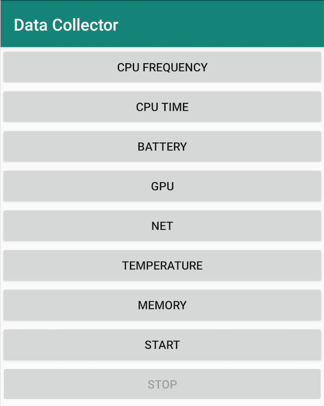
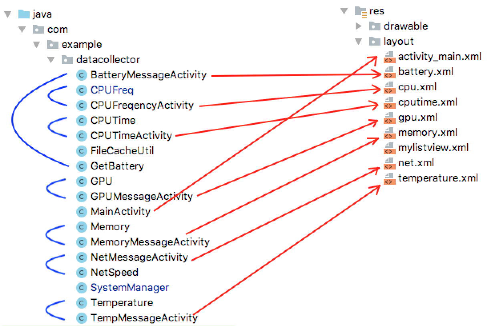
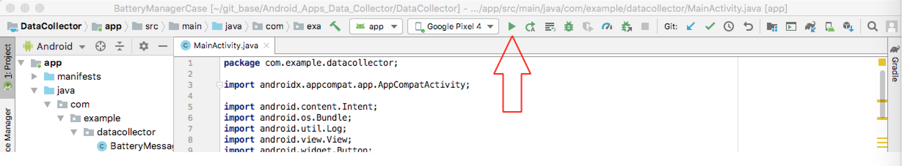
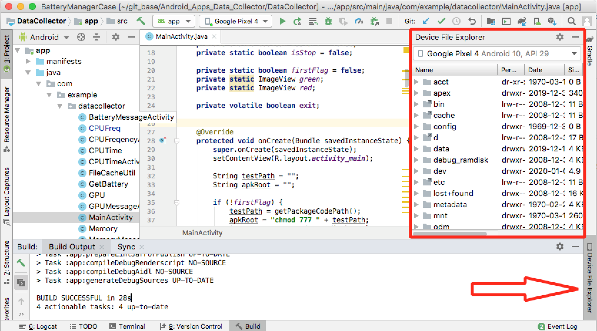
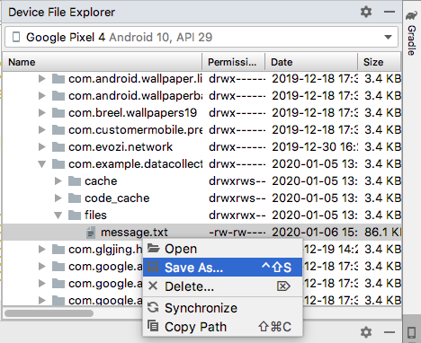

## Data Collector Document 1.0
> #### Summary
> #### Structure of Apps
> #### Data Access Permission
> #### Data Grab and Display
> #### Data storage
> #### How to use

## Summary
### 1. Goal
The Android Apps **Data Collector** is a tool to collect hardware level data and system statistics data from smartphone, such as CPU frequency, battery temperature, GPU usage, memory performance etc.. These raw data can be used to analyse performace of smartphone, such as power consumption and thermal issue and related problems. 
### 2. Limitation
In order to grab the most accurate data from different modules in smartphone, it is necessary to get part of data directly from hardware devices(node). So we have to use the rooted smartphones.Another pro is that, it is possible to grab data in higher frequency (once/sec in this apps). 

But the con is also obvious. It is hard to create general apps which fit all smartphones. In our experiment, we only support Pixel 4, Nexus 5, Nexus 6P and Samsung S10. 

***Note: The apps can only work on Pixel 4 without problem now (Jan 06 2020).***

## Structure of Apps
### 1. Function
There are two kinds of function in the apps. Below figure is the main page(activity). From button "CPU FREQUENCY" to "MEMORY", each one is a kind of data which this apps can collect. These buttons only lead to specific data display, **they won't cause any data storage in smartphone**.

The second function is data storage, only contains two buttons. Once click "START" button, the apps start to save data which relates to all type of above data in smartphone. The apps won't stop saving data until user clicks the "STOP" button. 

This apps can run in Android's background.

<center>

</center>

### 2. Code
The apps can be seperated into two parts, one is layout(right part), another is Java source code(left part).

<center>

</center>

Source code can be seperated into three parts:

+ data access permission (SystemManager.java)
+ data grab and display (from button "CPU FREQUENCY" to "MEMORY", each one has similar logic: activity + function + layout)
+ data storage (FileCacheUtil.java)

***Note: Follow above structure to add more "data type" to collect should be easy : )***

## Data Access Permission

In order to grab data from devices in smartphone directly, the first step is to root smartphone.

Then, in main page, we can call "RootCommand()" from SystemManager class to give this apps enough permission on several path/files.


**MainActivity.java**
```java
testPath = getPackageCodePath();
apkRoot = "chmod 777 " + testPath;
SystemManager.RootCommand(apkRoot);
```


**SystemManager.java**
```java
// get "SU" permission
process = Runtime.getRuntime().exec("su");
os = new DataOutputStream(process.getOutputStream());
os.writeBytes(command + "\n");

...

// using "SU" right to change permission mode on files which relate to battery
os.writeBytes("chmod 777 /sys/class/power_supply/battery/temp" + "\n");
os.writeBytes("chmod 777 /sys/class/power_supply/battery/voltage_now" + "\n");
os.writeBytes("chmod 777 /sys/class/power_supply/battery/current_avg" + "\n");
os.writeBytes("chmod 777 /sys/class/power_supply/battery/capacity" + "\n");

...

// using "SU" right to change permission mode on files which relate to cpu frequency
os.writeBytes("chmod 777 /sys/devices/system/cpu/cpufreq/policy0/cpuinfo_cur_freq" + "\n");
os.writeBytes("chmod 777 /sys/devices/system/cpu/cpufreq/policy4/cpuinfo_cur_freq" + "\n");
os.writeBytes("chmod 777 /sys/devices/system/cpu/cpufreq/policy7/cpuinfo_cur_freq" + "\n");
```
<font color=#204ff7>Note: Above configuration is from Pixel 4.</font>

## Data Grab and Display
From "CPU FREQUENCY" to "MEMORY", every button relates to **activity + function + layout**. Let's use "CPU FREQUENCY" as an example.


**CPUFreqencyActivity.class**
```java
// using handler to update related UI.
    private Handler handler = new Handler() {
        @Override
            public void handleMessage(Message msg) {
            //CPUFreq class is using for grab data from related devices
            List<String> frequencyList = CPUFreq.getFreq();
            ArrayAdapter<String> arrayAdapter = new ArrayAdapter<>(CPUFreqencyActivity.this, android.R.layout.simple_list_item_1, frequencyList);
            //in related layout, we use list view structure.
            listView.setAdapter(arrayAdapter);
            super.handleMessage(msg);
        }
    };

...

    @Override
    protected void onCreate(Bundle savedInstanceState) {
        super.onCreate(savedInstanceState);
        setContentView(R.layout.cpu);
        
        exit = false;
        listView = findViewById(R.id.listViewCPU);
        
        //update UI once/second
        new Thread() {
            @Override
            public void run() {
                try {
                    while (true) {
                        if (exit)
                            break;
                        Thread.sleep(1000);
                        Message msg = new Message();
                        handler.sendMessage(msg);
                    }
                } catch (InterruptedException e) {
                    e.printStackTrace();
                }
            }
        }.start();
    }
``` 


**CPUFreq.class**
```java
    //device path
    File dir = new File("/sys/devices/system/cpu/");
    
    File[] files = dir.listFiles(new FileFilter() {
        @Override
        public boolean accept(File file) {
            //using regular expression to detect how many cpus in the current smartphone.
            if (Pattern.matches("cpu[0-9]+", file.getName())) {
                return true;
            }
            return false;
        }
    });
    //get quantity of cpu
    final int SIZE = files.length;
    
    ...
    
    //base on the path and quantity of cpu, read frequency from each cpu.
    for (int i = 0; i < SIZE; i++) {
        br = new BufferedReader(new FileReader("/sys/devices/system/cpu/cpu" + i + "/cpufreq/cpuinfo_cur_freq"));
        line = br.readLine();
        if (line != null) {
            long frequency = Long.parseLong(line);
            if (frequency < 0) {
                temp = "Unknow";
            } else {
                temp = frequency+"";
            }
        }
        result.add("cpu" + i + " : " + temp);
    }	
```


**cpu.xml, this is the layout file, list view is used here.**
```xml
<?xml version="1.0" encoding="utf-8"?>
<LinearLayout xmlns:android="http://schemas.android.com/apk/res/android"
    android:layout_width="match_parent"
    android:layout_height="match_parent"
    android:orientation="vertical">
    
    <TextView
        android:layout_width="match_parent"
        android:layout_height="wrap_content"
        android:text="CPU FREQUENCY" />
    <ListView
        android:id="@+id/listViewCPU"
        android:layout_width="match_parent"
        android:layout_height="match_parent" />
</LinearLayout>
```

***Note: Follow above structure to add more "data type" to collect should be easy : )***

## Data storage
In Android, data persistence contains internal storage and external storage.

Each apps has its own internal storage, other apps(process) cannot access data in this private memory. Such data like login information, configuration file etc..

External storage is easy to understand. When smartphone's build-in camera takes photos, these photos are stored in the external storage area. Other apps can access these photos.

So, It is more general and convenient to use external storage to save data.

**Internal storage is used in current code(Jan 06 2020).**   

***Note: External storage method will be implemented later.***

Only "START" and "STOP" buttons relate to the storage function.


**FileCacheUtil.java**
```java
/*
*	this is a tool package for accessing internal storage
*	how to use:
*	    write:
* 	    FileCacheUtil.getInstance(getApplicationContext()).write("start ");
* 	    read:
* 	    String result = FileCacheUtil.getInstance(getApplicationContext()).read();
*
*  location: /data/data/com.example.batterymanagercase/files/message.txt
* */

//Singleton Pattern, double-checked locking

    private static FileCacheUtil fileCacheUtil;
    public static FileCacheUtil getInstance(Context context) {
        if (fileCacheUtil == null) {
            synchronized (FileCacheUtil.class) {
                if (fileCacheUtil == null) {
                    fileCacheUtil = new FileCacheUtil(context);
                }
            }
        }
        return fileCacheUtil;
    }
	
    ...
	
    //only the write function is needed in this apps
    public void write(String msg) {
        if (msg == null) {
            return;
        }
        try {
            //new data will be appended into "message.txt"
            FileOutputStream fos = context.openFileOutput(mFileName, MODE_APPEND);
            fos.write(msg.getBytes());
            fos.close();
        } catch (Exception e) {
            e.printStackTrace();
        }
    }
```


**MainActivity.java**
```java
    //when click "START" button, write function will be called.
    //all data will be grabbed once/second
    public void write() {
        new Thread() {
            @Override
            public void run() {
                try {
                    while (true) {
                        if (exit)
                            break;
                        StringBuilder sb = new StringBuilder();
                        Thread.sleep(1000);
                        
                        sb.append("****\n");
                        sb.append("time: " + Calendar.getInstance().getTime() + "\n");
                        
                        //-----cpu freq---------
                        sb.append("cpu freq:\n");
                        List<String> cpuFreq = CPUFreq.getFreq();
                        for (String str : cpuFreq) {
                            sb.append(str + "\n");
                        }
                        
                        ...
                        //-----Memory -------------
                        sb.append("Memory:\n");
                        List<String> memoryInfo = Memory.getData();
                        for (String str : memoryInfo) {
                            sb.append(str + "\n");
                        }
                        
                        //using the tool package which we implement to access internal storage
                        FileCacheUtil.getInstance(getApplicationContext()).write(sb.toString());
                    }
                } catch (Exception e) {
                    e.printStackTrace();
                }
            }
        }.start();
    }
```
## How to use

1. root smartphone
(Pixel 4: [https://www.youtube.com/watch?v=S2Ke36U2WqQ](https://www.youtube.com/watch?v=S2Ke36U2WqQ))

2. download apps project

3. use Android Studio open the project

4. use usb connect smartphone and PC, click "Run App" button in Android Studio to install the apps into smartphone.
<center>

</center>

5. on smartphone, trun on the apps, grant the permission at the first time.

6. click "START" button to start saving data into the smartphone. click "STOP" button to stop saving function. This apps can run in background, just feel free to run other apps simultaneously.

7. Once stop the saving function, we can use Android Studio to export data file from app's internal storage. Click the "Device File Explorer" button to open related window. 

<center>

</center>

Follow the path to find "message.txt" **/data/data/com.example.batterymanagercase/files/message.txt**
<center>

</center>

"Save As..." message.txt. Don't forget to "Delete..." this file, make sure we have a brand new file in NEXT experiment.


<center>

</center>
**Enjoy!**
